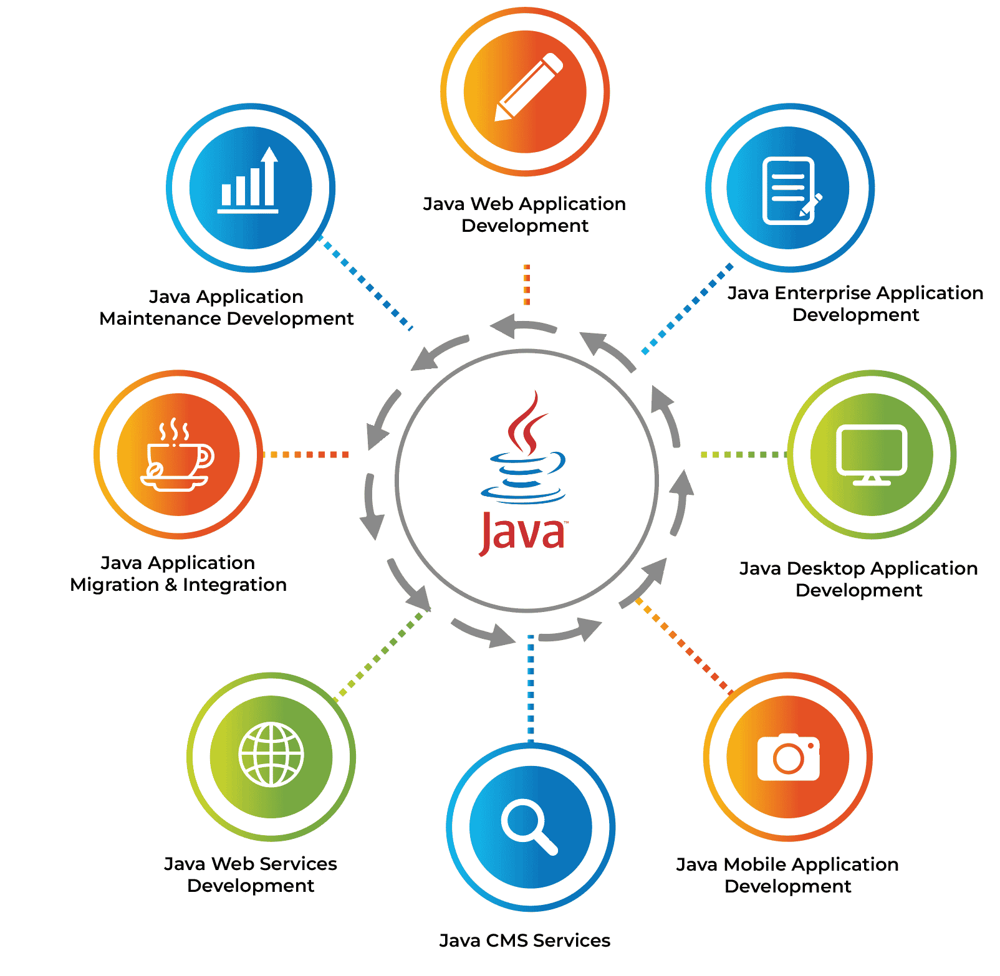

Java là một trong những **ngôn ngữ lập trình phổ biến và mạnh mẽ nhất** trên thế giới. Trong bài viết này, mình sẽ giới thiệu về **lịch sử ra đời, đặc điểm nổi bật và ứng dụng của Java**. <!--more-->

## 1. Lịch sử ra đời

- **Năm 1991**, nhóm Sun Microsystems do James Gosling dẫn đầu bắt đầu phát triển Java.  
- Mục tiêu: tạo ra **ngôn ngữ lập trình độc lập nền tảng**, an toàn và dễ sử dụng cho các thiết bị điện tử.  
- Ban đầu có tên là **Oak**, sau đổi thành **Java** theo ý tưởng từ hòn đảo Java nổi tiếng với cà phê Java.

*Feynman tip:* Bạn có thể tưởng tượng Java là **cầu nối giữa các hệ điều hành**, viết 1 lần, chạy mọi nơi.

## 2. Đặc điểm nổi bật

1. **Độc lập nền tảng (Write Once, Run Anywhere - WORA)**  
   - Tính Di động (Portability): Một chương trình Java được biên dịch (compile) thành mã byte (bytecode).

    - Môi trường Thực thi (JVM): Mã byte này không chạy trực tiếp trên hệ điều hành (như Windows, macOS, Linux) mà chạy trên một môi trường ảo gọi là Java Virtual Machine (JVM).

    - Khả năng Chạy Mọi nơi: JVM đóng vai trò như một lớp trung gian. Miễn là máy tính có cài đặt JVM tương ứng với hệ điều hành của nó, thì cùng một tập tin mã byte đó có thể chạy mà không cần biên dịch lại.

2. **Hướng đối tượng (OOP)**  
   - Tất cả là class, object.  
   - Giúp code **dễ bảo trì, mở rộng**.

3. **Quản lý bộ nhớ tự động**  
   - Java có **Garbage Collector**, giúp tránh rò rỉ bộ nhớ.

4. **Thư viện phong phú**  
   - Java cung cấp nhiều **API chuẩn**: GUI, mạng, IO, cơ sở dữ liệu, đa luồng.

5. **Bắt đầu với java - Hello World**
   - Đây là chương trình cơ bản nhất để in ra dòng chữ `"Hello World"`:  

```java
public class HelloWorld {
    public static void main(String[] args) {
        System.out.println("Hello World!");
    }
}
```
## 3. Ứng dụng của Java

- **Web development:** sử dụng Spring, Jakarta EE  
- **Mobile development:** Android app dùng Java  
- **Enterprise software:** phần mềm doanh nghiệp, hệ thống quản lý  
- **Embedded systems & IoT:** thiết bị nhúng, smart devices



## 4. Trải nghiệm và phương pháp học

- Khi học Java, mình áp dụng **phương pháp Feynman**:  
  - Viết lại kiến thức bằng lời của mình  
  - Giải thích cho bạn tưởng tượng hoặc tự làm sơ đồ  
- Từng bài thực hành nhỏ giúp **hiểu sâu khái niệm**, ví dụ viết class, tạo object, xử lý exception.

## 5. Kết luận

- Java là **ngôn ngữ mạnh mẽ, bền vững và phổ biến**.  
- Hiểu lịch sử và đặc điểm giúp **sử dụng Java hiệu quả hơn**.  
- Áp dụng **Feynman + thực hành liên tục** giúp ghi nhớ và hiểu sâu kiến thức Java.

