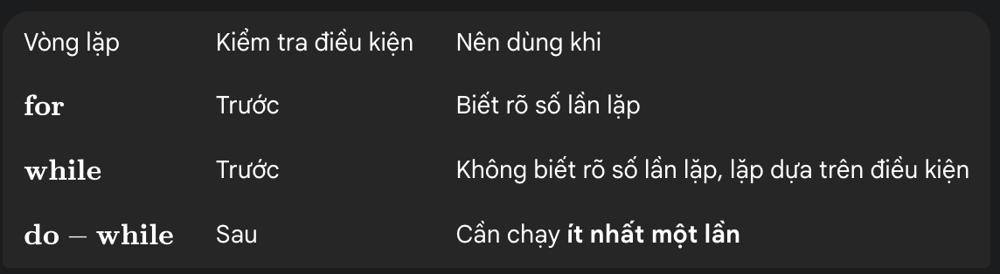

Vòng lặp giúp **làm việc lặp đi lặp lại** mà không viết lại code. Mình học bằng Feynman: “Vòng lặp = robot làm nhiệm vụ nhiều lần”.<!--more-->


## 1. Vòng lặp for

```java
for(int i=1; i<=5; i++){
  System.out.println(i);
}
```
- Trường hợp sử dụng chính:
- Khi bạn biết chính xác số lần lặp, hoặc khi bạn cần lặp qua một phạm vi giá trị xác định (ví dụ: đếm từ 1 đến 10, duyệt qua các phần tử của một mảng/Collection).
## 2. Vòng lặp while

```java
int i = 1;
while(i <= 5){
  System.out.println(i);
  i++;
}
```

- Trường hợp sử dụng chính:
- Khi bạn không biết trước số lần lặp, và vòng lặp chỉ dừng lại khi một điều kiện cụ thể được thỏa mãn (ví dụ: đọc dữ liệu từ file cho đến khi hết file, xử lý input từ người dùng cho đến khi họ nhập "quit").

## 3. Vòng lặp do-while

```java
int i = 1;
do{
  System.out.println(i);
  i++;
}while(i <= 5);
```
- Trường hợp sử dụng chính:
- Khi bạn cần đảm bảo khối lệnh luôn được thực thi ít nhất một lần, sau đó mới kiểm tra điều kiện để quyết định có lặp tiếp hay không (ví dụ: xây dựng menu tương tác, nơi bạn luôn phải hiển thị menu cho người dùng ít nhất một lần để họ chọn).

## 4.Tóm tắt nhanh

## 5. Trải nghiệm học

Viết nhiều ví dụ vòng lặp lồng nhau

Vẽ sơ đồ flow → hiểu nhanh

## 6. Kết luận

Vòng lặp là nền tảng lập trình

---
<div style="text-align:center; background:#f0f8ff; border-left:5px solid #007acc; border-radius:10px; padding:15px; font-size:1.1em;">
🎯 <strong>Chúc những ai đang đọc blog này luôn giữ được niềm đam mê học hỏi, kiên trì và sớm trở thành những lập trình viên Java vững vàng, tự tin bước vào thế giới công nghệ!</strong> 🚀  
<br><em>— Đăng Nguyễn Hải</em>
</div>